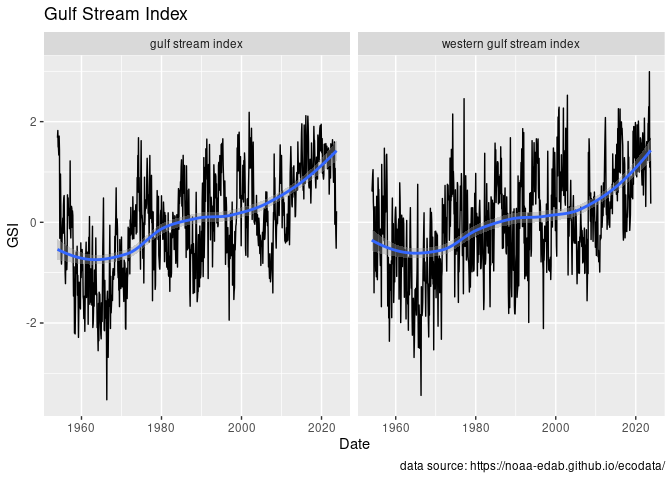
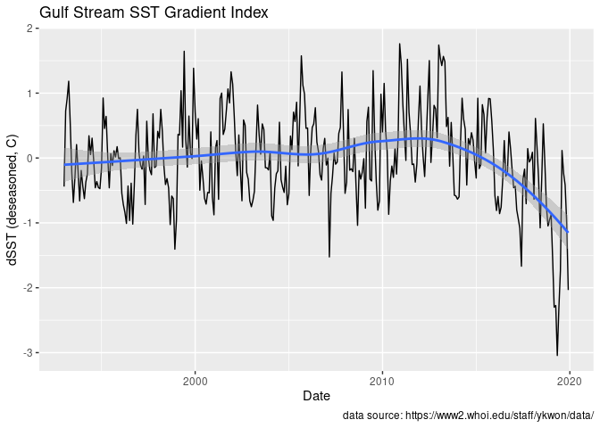
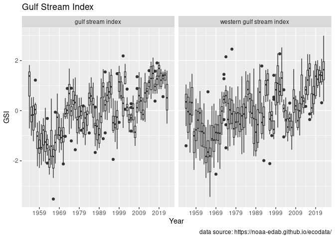
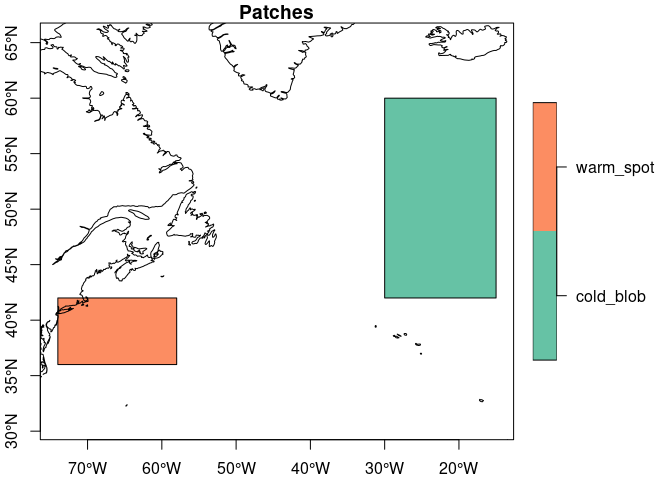
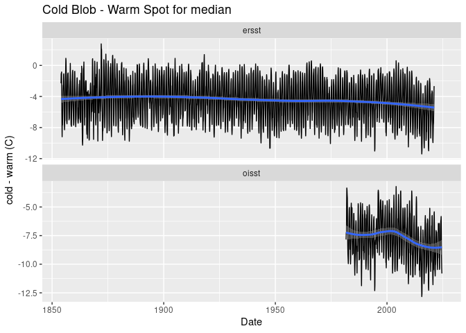
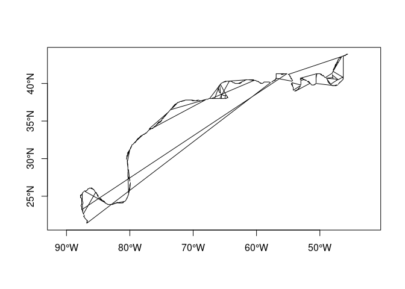
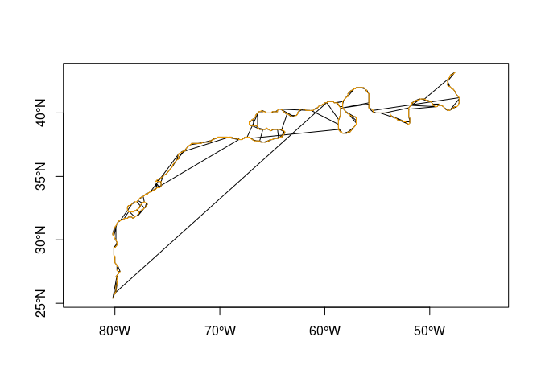

gstream
================

Serving Gulf Stream datasets directly from R.

## Requirements

[R v4.1+](https://www.r-project.org/)

[rlang](https://CRAN.R-project.org/package=rlang)

[dplyr](https://CRAN.R-project.org/package=dplyr)

[sf](https://CRAN.R-project.org/package=sf)

## Installation

Use the [remotes](https://CRAN.R-project.org/package=remotes) package to
install directly from github.

    remotes::install("BigelowLab/gstream)

## Usage

The package contains a number of data sets compiled with the purpose of
aiding Gulf Stream and AMOC analyses. Beyond access and simple plotting
utilities, no effort has been made to include sophisticated analyses.

``` r
suppressPackageStartupMessages({
  library(gstream)
  library(sf)
  library(dplyr)
  library(rnaturalearth)
})
```

## Gulf Stream Index (GSI)

The [Gulf Stream
Index](https://en.wikipedia.org/wiki/Latitude_of_the_Gulf_Stream_and_the_Gulf_Stream_north_wall_index)
provides a positional index. Data are provides via the
[ecodata](https://noaa-edab.github.io/ecodata/) R package. If the
package is installed, then this package serves the data it provides with
a convneient plotting routine. If the package is not installed, then it
is an error to try to read the GSI index with this package.

``` r
x = read_gsi() |>
  dplyr::glimpse()
```

    ## Loading required namespace: ecodata

    ## Rows: 1,676
    ## Columns: 5
    ## $ date  <date> 1954-01-01, 1954-01-01, 1954-02-01, 1954-02-01, 1954-03-01, 195…
    ## $ Time  <dbl> 1954.01, 1954.01, 1954.02, 1954.02, 1954.03, 1954.03, 1954.04, 1…
    ## $ Var   <chr> "gulf stream index", "western gulf stream index", "gulf stream i…
    ## $ Value <dbl> 1.6811664, 0.6118636, 1.8233541, 0.6203325, 1.5028627, 0.7795198…
    ## $ EPU   <chr> "All", "All", "All", "All", "All", "All", "All", "All", "All", "…

``` r
plot(x)
```

<!-- -->

## Gulf Stream SST Gradient Index (GSGI)

[Parfitt, Kwon, and Andres,
2022](https://agupubs.onlinelibrary.wiley.com/doi/10.1029/2022GL100914)
proposed a Gulf Stream Gradient Index. Data is served for 2004-2019
[here](https://www2.whoi.edu/staff/ykwon/data/).

> Parfitt, R., Y.-O. Kwon, and M. Andres, 2022: A monthly index for the
> large-scale sea surface temperature gradient across the separated Gulf
> Stream. Geophys. Res. Lett., 49, e2022GL100914.
> <https://doi.org/10.1029/2022GL100914>.

``` r
x = read_gsgi() |>
  dplyr::glimpse()
```

    ## Rows: 324
    ## Columns: 4
    ## $ date           <date> 1993-01-01, 1993-02-01, 1993-03-01, 1993-04-01, 1993-0…
    ## $ SST.N.deseason <dbl> -0.73139479, 0.37673571, 0.55352506, 0.89345027, 0.2047…
    ## $ SST.S.deseason <dbl> -0.29115456, -0.34953310, -0.35755056, -0.29019442, -0.…
    ## $ dSST.deseason  <dbl> -0.44024022, 0.72626881, 0.91107561, 1.18364469, 0.5361…

``` r
plot(x)
```

<!-- -->

## Data from [RAPID-AMOC](https://rapid.ac.uk/rapidmoc)

Data from the RAPID AMOC monitoring project is funded by the Natural
Environment Research Council and are freely available from
www.rapid.ac.uk/rapidmoc.

Reference for Version v2020.2 \>Moat B.I.; Frajka-Williams E., Smeed
D.A.; Rayner D.; Johns W.E.; Baringer M.O.; Volkov, D.; Collins, J.
(2022). Atlantic meridional overturning circulation observed by the
RAPID-MOCHA-WBTS (RAPID-Meridional Overturning Circulation and Heatflux
Array-Western Boundary Time Series) array at 26N from 2004 to 2020
(v2020.2), British Oceanographic Data Centre - Natural Environment
Research Council, UK. <doi:10.5285/e91b10af-6f0a-7fa7-e053-6c86abc05a09>

``` r
x = read_moc_transports() |>
  dplyr::glimpse()
```

    ## Rows: 13,057
    ## Columns: 10
    ## $ date         <date> 2004-01-02, 2004-01-02, 2004-01-03, 2004-01-03, 2004-01-…
    ## $ t_therm10    <dbl> NA, NA, NA, NA, NA, NA, NA, NA, NA, NA, -16.71886, -16.94…
    ## $ t_aiw10      <dbl> NA, NA, NA, NA, NA, NA, NA, NA, NA, NA, 0.8313935, 0.7999…
    ## $ t_ud10       <dbl> NA, NA, NA, NA, NA, NA, NA, NA, NA, NA, -9.957221, -9.954…
    ## $ t_ld10       <dbl> NA, NA, NA, NA, NA, NA, NA, NA, NA, NA, -3.133432, -3.305…
    ## $ t_bw10       <dbl> NA, NA, NA, NA, NA, NA, NA, NA, NA, NA, 1.4894769, 1.4455…
    ## $ t_gs10       <dbl> NA, NA, NA, NA, NA, NA, NA, NA, NA, NA, 28.60981, 28.4917…
    ## $ t_ek10       <dbl> NA, NA, NA, NA, NA, NA, NA, NA, NA, NA, -1.1396932, -0.55…
    ## $ t_umo10      <dbl> NA, NA, NA, NA, NA, NA, NA, NA, NA, NA, -15.85125, -16.10…
    ## $ moc_mar_hc10 <dbl> NA, NA, NA, NA, NA, NA, NA, NA, NA, NA, 11.63748, 11.8528…

``` r
plot(x)
```

    ## Warning: Removed 180 rows containing non-finite outside the scale range
    ## (`stat_smooth()`).

    ## Warning: Removed 20 rows containing missing values or values outside the scale range
    ## (`geom_line()`).

<!-- -->

## SST Patch Data

We defined two bounding boxes in the North Atlantic - one for the
persistent “cold blob” centered south of Iceland and another for the
“warm spot” south of New England and Martime Canada. We extracted
monthly
[ERSST](https://www.ncei.noaa.gov/products/extended-reconstructed-sst)
data and computed monthly
[OISST](https://www.ncei.noaa.gov/products/optimum-interpolation-sst)
sea surface temperature statistics for each.

``` r
# read the boxes but exclude the northern hemisphere record
bb = read_patch_bbs() |>
  dplyr::filter(name != "nh")
bb
```

    ## Simple feature collection with 2 features and 1 field
    ## Geometry type: POLYGON
    ## Dimension:     XY
    ## Bounding box:  xmin: -74 ymin: 36 xmax: -15 ymax: 60
    ## Geodetic CRS:  WGS 84
    ## # A tibble: 2 × 2
    ##   name                                            geom
    ## * <chr>                                  <POLYGON [°]>
    ## 1 cold_blob ((-30 42, -15 42, -15 60, -30 60, -30 42))
    ## 2 warm_spot ((-74 36, -58 36, -58 42, -74 42, -74 36))

``` r
x = read_patch_month() |>
  dplyr::glimpse()
```

    ## Rows: 5,046
    ## Columns: 9
    ## $ date   <date> 1854-01-01, 1854-02-01, 1854-03-01, 1854-04-01, 1854-05-01, 18…
    ## $ region <chr> "cold_blob", "cold_blob", "cold_blob", "cold_blob", "cold_blob"…
    ## $ source <chr> "ersst", "ersst", "ersst", "ersst", "ersst", "ersst", "ersst", …
    ## $ min    <dbl> 8.886023, 9.316138, 8.727843, 8.101231, 8.113076, 7.979538, 8.8…
    ## $ q25    <dbl> 10.321997, 10.784625, 10.092959, 9.832815, 10.034244, 10.801755…
    ## $ median <dbl> 11.16081, 11.27052, 10.82493, 11.25506, 11.79660, 13.18124, 15.…
    ## $ mean   <dbl> 11.39416, 11.53059, 11.10309, 11.34614, 11.86744, 13.19618, 15.…
    ## $ q75    <dbl> 12.43899, 12.25503, 11.89755, 12.79622, 13.57947, 15.63272, 18.…
    ## $ max    <dbl> 14.99075, 14.55934, 14.96488, 15.87475, 17.07551, 19.63632, 22.…

``` r
plot_patch_location(bb)
```

<!-- -->

``` r
plot(x)
```

<!-- -->

## Data from US Navy

### Arhcived data

[NOAA’s Ocean Prediction Center](https://ocean.weather.gov/) provides a
FTP server\](<https://ftp.opc.ncep.noaa.gov/grids/experimental/GStream>)
for downloads by year. We have downloaded these and repackaged into
spatial format files - these are included with the `gstream` package.
They also provide [daily
updates](https://ocean.weather.gov/gulf_stream_latest.txt).

``` r
x = read_usn(what = "orig") |>
  dplyr::glimpse()
```

    ## Rows: 3,905
    ## Columns: 3
    ## $ date <date> 2010-01-22, 2010-01-22, 2010-01-25, 2010-01-25, 2010-01-27, 2010…
    ## $ wall <chr> "north", "south", "north", "south", "north", "south", "north", "s…
    ## $ geom <MULTIPOINT [°]> MULTIPOINT ((-80.2 25), (-8..., MULTIPOINT ((-77.5 31.…

This reads in all of the data stored with the package. We can then do a
simple plot of all of the locations.

``` r
bb = sf::st_bbox(x)
coast = rnaturalearth::ne_coastline(scale = "medium", returnclass = "sf")

plot(x['wall'], pch = ".", axes = TRUE, reset = FALSE)
plot(sf::st_geometry(coast), add = TRUE)
```

<!-- -->

### Downloading daily updates and configuration

**Note** that you don’t need to create the configuration file if you are
not downloading data.

The daily data is hosted by by [NOAA’s Ocean Prediction
Center](https://ocean.weather.gov/) In particular they post the US
Navy’s [daily Gulf Stream point
data](https://ocean.weather.gov/gulf_stream_latest.txt) for the north
and south walls. These can be downloaded. We provide a mechanism for
storing the URL of the daily data, the path to where you want to store
the downloads and a simple script for downloading. The configuration can
be stored anywhere, but by default we look for it isn `~/.gstream`.

``` r
cfg = read_configuration()
cfg
```

    ## $usn
    ## $usn$datapath
    ## [1] "/mnt/s1/projects/ecocast/coredata/gstream/usn"
    ## 
    ## $usn$rawpath
    ## [1] "/mnt/s1/projects/ecocast/coredata/gstream/usn/raw"
    ## 
    ## $usn$dailyuri
    ## [1] "https://ocean.weather.gov/gulf_stream_latest.txt"
    ## 
    ## $usn$ftpuri
    ## [1] "https://ftp.opc.ncep.noaa.gov/grids/experimental/GStream"

Obviously, you will want to modify the `rawpath` to suit your own needs.
We then set up a cron job to make the daily download at local 6pm.

    # gstream data
    0 18 * * * /usr/local/bin/Rscript /Users/ben/Library/CloudStorage/Dropbox/code/projects/gsi/inst/scripts/usn_daily_download.R >> /dev/null 2>&1

### Ordering USN data

The USN data is not ordered, that is the points for a given day are not
following a polyline.

``` r
d = dplyr::filter(x, date == as.Date("2020-12-19"), wall == "north")
plot(sf::st_geometry(d), type = "l", axes = TRUE)
```

<!-- -->

With thanks to [Dewey
Dunnington](https://gist.github.com/paleolimbot/0be47836de5008f308959923dac02c5b#gistcomment-5079768)
we can reorder them into a single `LINESTRING`.

``` r
d = dplyr::filter(x, date == as.Date("2020-01-03"), wall == "north")
do = order_usn(d)
plot(sf::st_geometry(d), type = "l", axes = TRUE, reset= FALSE)
plot(sf::st_geometry(do), type = "l", add = TRUE, col = "orange")
```

<!-- -->
