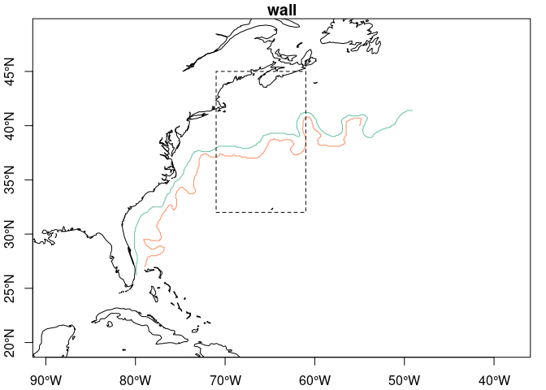
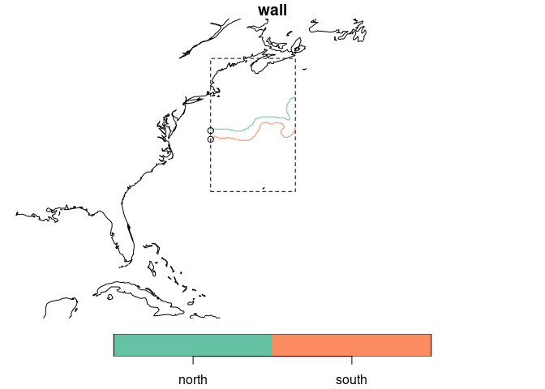
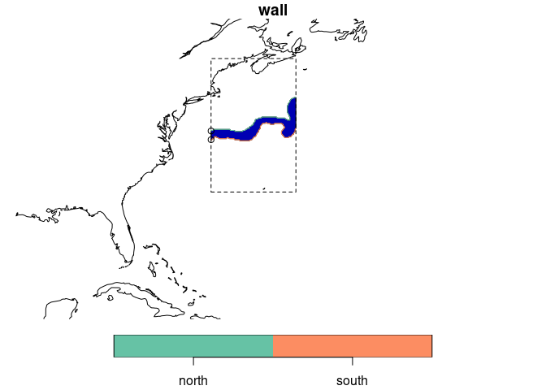
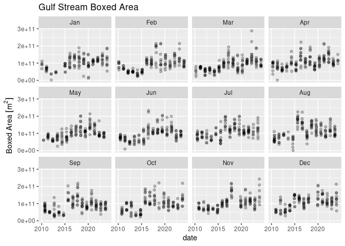
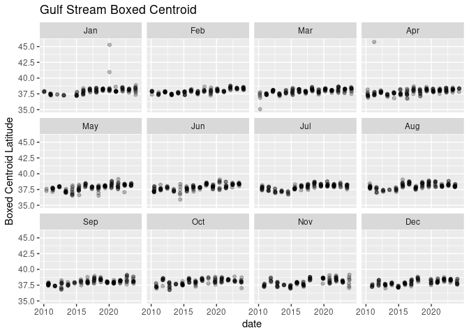

gstream_width
================

Load the data and select the first data (north and south walls) as an
example.

``` r
suppressPackageStartupMessages({
  library(sf)
  library(dplyr)
  library(gstream)
  library(rnaturalearth)
  library(units)
  library(ggplot2)
})
coast = rnaturalearth::ne_coastline(scale = "medium", returnclass = "sf")

All = gstream::read_usn()
BB = sf::st_bbox(All)
x = All |>
  dplyr::slice_max(date)
```

Now make a somewhat arbitrary box.

``` r
west = -71
east = -61
north = 45
south = 32
bb = sf::st_bbox(c(xmin = west, ymin = south, xmax = east, ymax = north),
                 crs = sf::st_crs(All)) |>
  sf::st_as_sfc()


plot(x['wall'], pch = ".", axes = TRUE, reset = FALSE, extent = BB, key.pos = NULL)
plot(bb, add = TRUE, lty = "dashed")
plot(sf::st_geometry(coast), add = TRUE)
```

<!-- -->

Now we crop the wall data to the box. Plotted below shows that the lines
are both oriented eastward (first point of each plotted with circle
symbol.)

``` r
z = crop_usn(x, bb) 
```

    ## Spherical geometry (s2) switched off

    ## although coordinates are longitude/latitude, st_intersection assumes that they
    ## are planar

    ## Spherical geometry (s2) switched on

``` r
p = st_cast(z, "POINT")

plot(z['wall'], reset = FALSE, extent = BB)
plot(p['wall'] |> dplyr::filter(wall == 'north') |> dplyr::slice(1), add = TRUE, col = "black")
plot(p['wall'] |> dplyr::filter(wall == 'south') |> dplyr::slice(1), add = TRUE, col = "black")
plot(bb, add = TRUE, lty = "dashed")
plot(sf::st_geometry(coast), add = TRUE)
```

<!-- -->

Now merge the two lines into a closed polygon.

``` r
poly = walls_to_polygons(z)
```

    ## Spherical geometry (s2) switched off

    ## Spherical geometry (s2) switched on

``` r
plot(z['wall'], reset = FALSE, extent = BB)
plot(poly[1], add = TRUE)
plot(z['wall'], add = TRUE)
plot(p['wall'] |> dplyr::filter(wall == 'north') |> dplyr::slice(1), add = TRUE, col = "black")
plot(p['wall'] |> dplyr::filter(wall == 'south') |> dplyr::slice(1), add = TRUE, col = "black")
plot(bb, add = TRUE, lty = "dashed")
plot(sf::st_geometry(coast), add = TRUE)
```

<!-- -->

Let’s take a bigger slice of the dataset. Below we can see how the
process can be streamlined (no pun intended). We’ll add a `month`
category for subsequent plotting.

``` r
VERBOSE = TRUE
p = read_usn() |>
  crop_usn(bb) |>
  walls_to_polygons() |>
  dplyr::mutate(month = factor(format(date, "%b"), levels = month.abb),  .after = 1)
```

    ## Spherical geometry (s2) switched off

    ## although coordinates are longitude/latitude, st_intersection assumes that they
    ## are planar

    ## Spherical geometry (s2) switched on

``` r
p
```

    ## Simple feature collection with 1817 features and 5 fields
    ## Geometry type: POLYGON
    ## Dimension:     XY
    ## Bounding box:  xmin: -71 ymin: 33.3 xmax: -61 ymax: 42.2
    ## Geodetic CRS:  WGS 84
    ## First 10 features:
    ##          date month               area        xc       yc
    ## 1  2010-01-18   Jan  67924987615 [m^2] -68.48640 37.79312
    ## 2  2010-01-20   Jan  92609425971 [m^2] -68.13434 37.83405
    ## 3  2010-01-22   Jan  90918464157 [m^2] -67.99032 37.80366
    ## 4  2010-01-25   Jan  99483924729 [m^2] -68.37751 37.90268
    ## 5  2010-01-27   Jan 111980508214 [m^2] -68.04891 37.93008
    ## 6  2010-02-05   Feb  99335789947 [m^2] -68.16625 37.87678
    ## 7  2010-02-08   Feb 108074711539 [m^2] -67.93398 37.93719
    ## 8  2010-02-10   Feb 107241087772 [m^2] -67.91253 37.96162
    ## 9  2010-02-12   Feb  98219004880 [m^2] -67.72134 37.85155
    ## 10 2010-02-15   Feb  99851771344 [m^2] -67.75873 37.86907
    ##                          geometry
    ## 1  POLYGON ((-71 37.1, -70.9 3...
    ## 2  POLYGON ((-71 36.95, -70.9 ...
    ## 3  POLYGON ((-71 36.95, -70.9 ...
    ## 4  POLYGON ((-71 37.55, -70.7 ...
    ## 5  POLYGON ((-71 37.2, -70.8 3...
    ## 6  POLYGON ((-71 37.46667, -70...
    ## 7  POLYGON ((-71 37.46667, -70...
    ## 8  POLYGON ((-71 37.5, -70.8 3...
    ## 9  POLYGON ((-71 37.54, -70.7 ...
    ## 10 POLYGON ((-71 37.54, -70.7 ...

Let’s plot up some time series.

``` r
ggplot(data = p, aes(x = date, y = area)) +
  geom_point(alpha = 0.25) + 
  labs(y = "Boxed Area", title = "Gulf Stream Boxed Area") + 
  facet_wrap(~month)
```

<!-- -->

``` r
ggplot(data = filter(p, yc < 100), aes(x = date, y = yc)) +
  geom_point(alpha = 0.25) + 
  labs(y = "Boxed Centroid Latitude", title = "Gulf Stream Boxed Centroid") + 
  facet_wrap(~month)
```

<!-- -->
